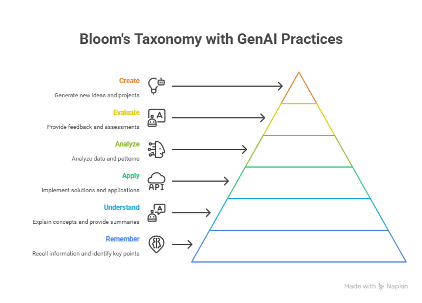

# Teaching and Learning Process Framework

## 1. Pedagogical-Didactic Planning
*Strategic and intentional groundwork for teaching*

- Define course goals and learning outcomes  
- Align outcomes with program objectives and accreditation standards  
- Select teaching approaches (e.g., active learning, inquiry-based, project-based)  
- Choose educational technologies and AI-enhanced tools  
- Consider learner profiles and diversity (prior knowledge, needs, access)  

## Hands-on

### Define Course Goals and Learning Outcomes
**Task:**
Clarify what learners should be able to know, do, or value by the end of the course.

**Instructional + Role-Based Prompt**
```
I am a higher-education teacher designing a course titled "Teaching and Learning with AI". The target audience is higher education faculty and students. Suggest 3–5 clear learning outcomes using Bloom’s taxonomy across different cognitive levels. Focus on skills related to using generative AI for teaching, learning, and assessment.
```



---

## 2. Class Design and Development
*Structuring the learning experience for clarity, engagement, and progression*

- Break down content into modules or units  
- Design each class session (objectives, sequence, timing, materials)  
- Incorporate diverse learning modalities (visual, auditory, kinesthetic)  
- Integrate digital content, simulations, or AI co-creation tools  
- Develop lesson plans, slide decks, and in-class activities  
- Scaffold complexity and cognitive load  

---

## 3. Preparation of Assignments and Exams
*Creating opportunities for practice, application, and evaluation*

- Design formative and summative assessments aligned with learning outcomes  
- Use rubrics to define performance expectations  
- Create authentic tasks (e.g., case studies, real-world problems, AI-assisted projects)  
- Balance low- and high-stakes activities  
- Ensure accessibility and academic integrity  
- Use AI to draft, refine, or personalize assignments and quizzes  

---

## 4. Teaching the Classes (Class Delivery)
*Enacting the instructional plan with flexibility and engagement*

- Facilitate active, student-centered learning (e.g., discussion, problem-solving)  
- Use storytelling, examples, demonstrations, and Socratic questioning  
- Employ tech and AI tools for content delivery (e.g., ChatGPT, simulations, visualizations)  
- Monitor engagement and comprehension in real time  
- Adapt pacing and methods responsively  

---

## 5. Student Support
*Promoting academic success and well-being*

- Provide office hours and timely responses to inquiries  
- Offer guidance on assignments and study strategies  
- Identify struggling students early and intervene  
- Create a climate of psychological safety and inclusiveness  
- Provide AI-curated resources (e.g., study guides, tutoring suggestions)  
- Encourage peer collaboration and support networks  

---

## 6. Assessment and Feedback
*Measuring learning and guiding improvement*

- Conduct assessments (projects, exams, portfolios, presentations)  
- Provide timely, specific, and constructive feedback  
- Use self- and peer-assessment tools  
- Incorporate AI for feedback generation, plagiarism detection, or automated grading (as appropriate)  
- Analyze data to identify learning gaps and misconceptions  

---

## 7. Reflection and Improvement
*Closing the loop through critical self-analysis and iteration*

- Reflect on teaching effectiveness using student feedback, learning data, and peer observations  
- Identify what worked, what didn’t, and why  
- Revise materials, strategies, and assessments for future iterations  
- Stay engaged with research and innovations in pedagogy and educational technology  
- Share experiences with colleagues to foster a culture of reflective teaching  


